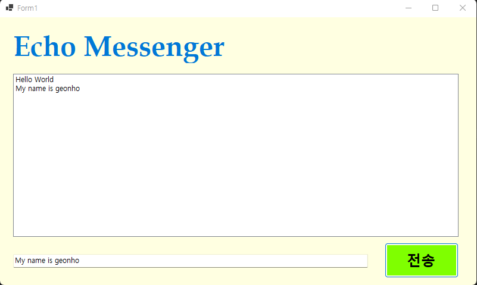
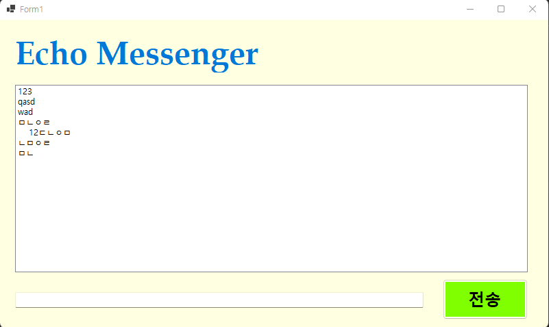

# (C# 코딩) 에코 메신저

## 개요
- C# 프로그래밍 학습
- 1줄 소개: 사용자의 키보드 입력으로 받은 텍스트를 그대로 출력하는 간단한 메신저 프로그램
- 사용한 플랫폼:
	- C#, .NET Windows Forms, Visual Studio, GitHub
- 사용한 컨트롤:
	- Label, TextBox, Button, ListBox
- 사용한 기술과 구현한 기능:
	- Visual Studio를 사용하여 UI 디자인
	- string 클래스를 이용하여 사용자 입력 데이터 처리

## 실행 화면 (과제1)
- 과제1 코드의 실행 스크린샷

- 과제 내용
	- Label, TextBox, Button, ListBox 컨트롤을 사용하여 간단한 메신저 UI를 구성
	- 전송 버튼 클릭시 TextBox의 텍스트를 ListBox에 추가하여 출력하는 기능 구현
- 사용한 기술과 구현한 기능:
	- Visual Studio를 사용하여 UI 디자인
	- Button 클릭 이벤트 핸들러를 통해 TextBox의 텍스트를 ListBox에 추가하는 기능 구현
	- string을 이용하여 입력 데이터 처리

## 실행 화면 (과제2)
- 과제2 코드의 실행 스크린샷

- 과제 내용
	- 사용자 편의성을 위한 UX 개선
	- 조건부를 이용한 편의기능 구성
- 사용한 기술과 구현한 기능:
	- KeyDown을 이용하여 Enter 키 입력 시 전송 버튼 클릭과 동일한 기능 구현
	- IsNullOrWhiteSpace를 이용하여 공백 입력 방지 기능 구현