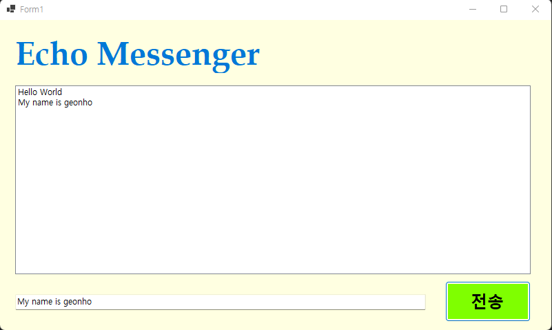
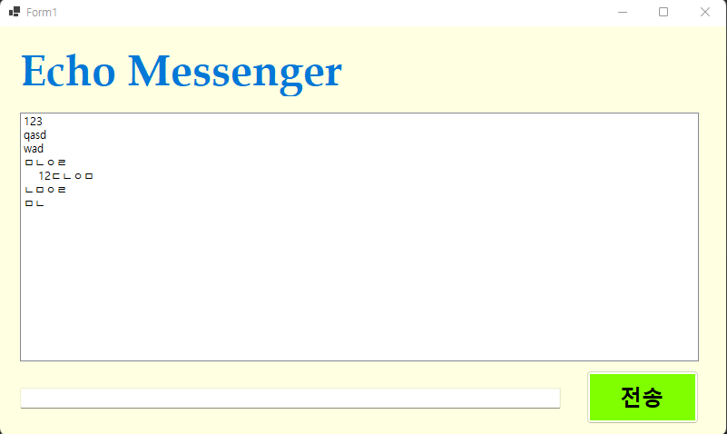
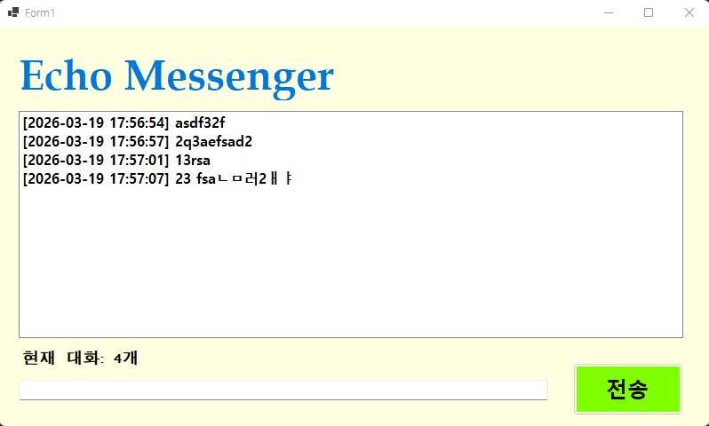
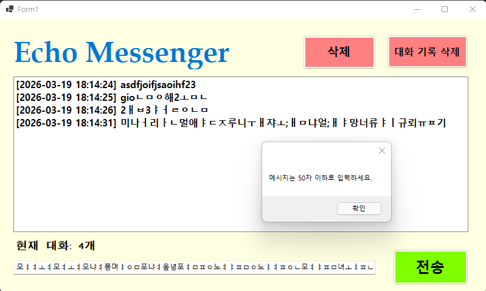

# (C# 코딩) 에코 메신저

## 개요
- C# 프로그래밍 학습
- 1줄 소개: 사용자의 키보드 입력으로 받은 텍스트를 리스트에 출력하는 간단한 메신저 프로그램
- 사용한 플랫폼:
	- C#, .NET Windows Forms, Visual Studio, GitHub
- 사용한 컨트롤:
	- Label, TextBox, Button, ListBox
- 사용한 기술과 구현한 기능:
	- Visual Studio 디자이너를 활용한 UI 구성
	- string 클래스를 이용한 사용자 입력 데이터 처리
	- Trim(), IsNullOrWhiteSpace()를 이용한 입력값 정제 및 공백 입력 방지
	- DateTime 클래스를 이용한 현재 시간 정보 생성 및 타임스탬프 출력
	= 이벤트 기반 프로그래밍(Button Click, KeyDown)을 통한 사용자 입력 처리

## 실행 화면 (과제1)
- 과제1 코드의 실행 스크린샷

- 과제 내용
	- Label, TextBox, Button, ListBox를 활용하여 기본적인 메신저 UI 구성
	- 버튼 클릭 시 TextBox의 입력값을 ListBox에 추가하여 출력
- 구현 내용과 기능 설명
	- 사용자가 입력한 문자열을 받아 리스트에 순차적으로 출력
	- 버튼 클릭 이벤트를 통해 메시지 전송 기능 구현
	- 기본적인 UI 배치 및 컨트롤 간 동작 연결
- 사용한 기술과 구현한 기능:
	- Button Click 이벤트 핸들러 사용
	- string 타입을 이용한 입력 데이터 처리
	- ListBox의 Items.Add()를 통한 데이터 추가

## 실행 화면 (과제2)
- 과제2 코드의 실행 스크린샷

- 과제 내용
	- 사용자 편의성을 위한 기능 개선
	- 키보드 입력을 통한 메시지 전송 기능 추가
- 구현 내용과 기능 설명
	- Enter 키 입력 시 버튼 클릭과 동일하게 메시지가 전송되도록 구현
	- 공백 또는 빈 문자열 입력을 방지하여 불필요한 데이터 입력 차단
	- 메시지 전송 후 자동으로 입력창에 포커스가 이동하도록 설정
- 사용한 기술과 구현한 기능:
	- KeyDown 이벤트를 활용한 키 입력 처리
	- PerformClick()을 이용한 버튼 이벤트 재사용
	- IsNullOrWhiteSpace()를 통한 입력값 검증
	- Focus()를 이용한 입력창 커서 유지

## 실행 화면 (과제3)
- 과제3 코드의 실행 스크린샷

- 과제 내용
	- 메시지 데이터 가공 및 상태 표시 기능 구현
	- 시간 정보와 메시지 개수 출력
- 구현 내용과 기능 설명
	- 메시지 전송 시 현재 시간을 함께 출력하여 타임스탬프 기능 구현
	- 입력값의 앞뒤 공백을 제거하여 데이터 정제
	- ListBox에 저장된 메시지 개수를 Label을 통해 실시간으로 표시
- 사용한 기술과 구현한 기능:
	- DateTime.Now를 이용한 현재 시간 생성
	- ToString("HH:mm:ss") 형식으로 시간 문자열 변환
	- Trim()을 통한 문자열 공백 제거
	- Items.Count를 이용한 메시지 개수 계산

## 실행 화면 (과제4)
- 과제3 코드의 실행 스크린샷

- 과제 내용
	- 메시지 관리 및 입력 제한 기능 구현
	- 선택 삭제 및 전체 삭제 기능 추가
- 구현 내용과 기능 설명
	- ListBox에서 선택한 메시지를 삭제하는 기능 구현
	- 선택되지 않은 상태에서 삭제 시 오류가 발생하지 않도록 예외 처리
	- 전체 메시지를 한 번에 삭제하는 기능 추가
	- 입력 가능한 메시지 길이를 50자로 제한하여 데이터 관리
- 사용한 기술과 구현한 기능:
	- RemoveAt()을 이용한 선택 항목 삭제
	- Clear()를 이용한 전체 데이터 삭제
	- SelectedIndex를 통한 선택 여부 확인
	- TextBox MaxLength 및 Length 검사를 통한 글자 수 제한
